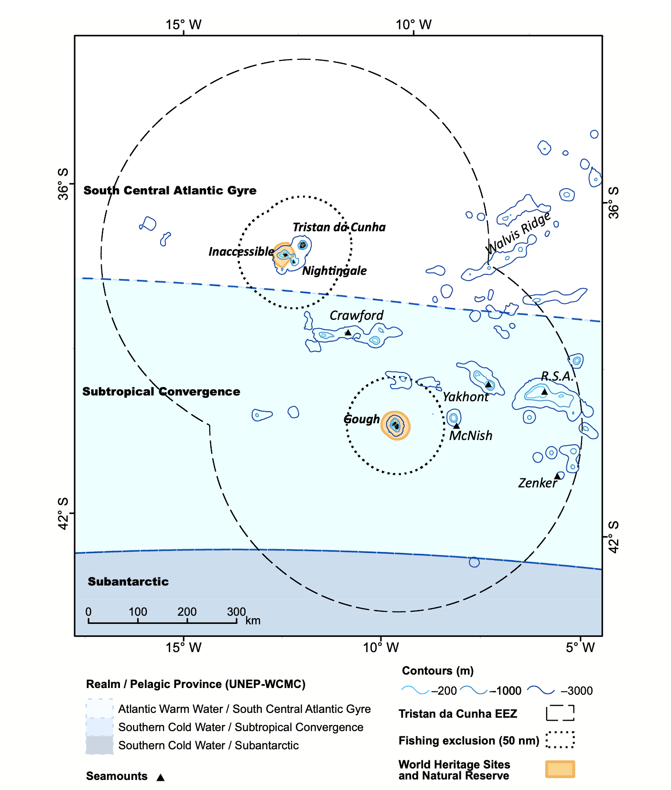
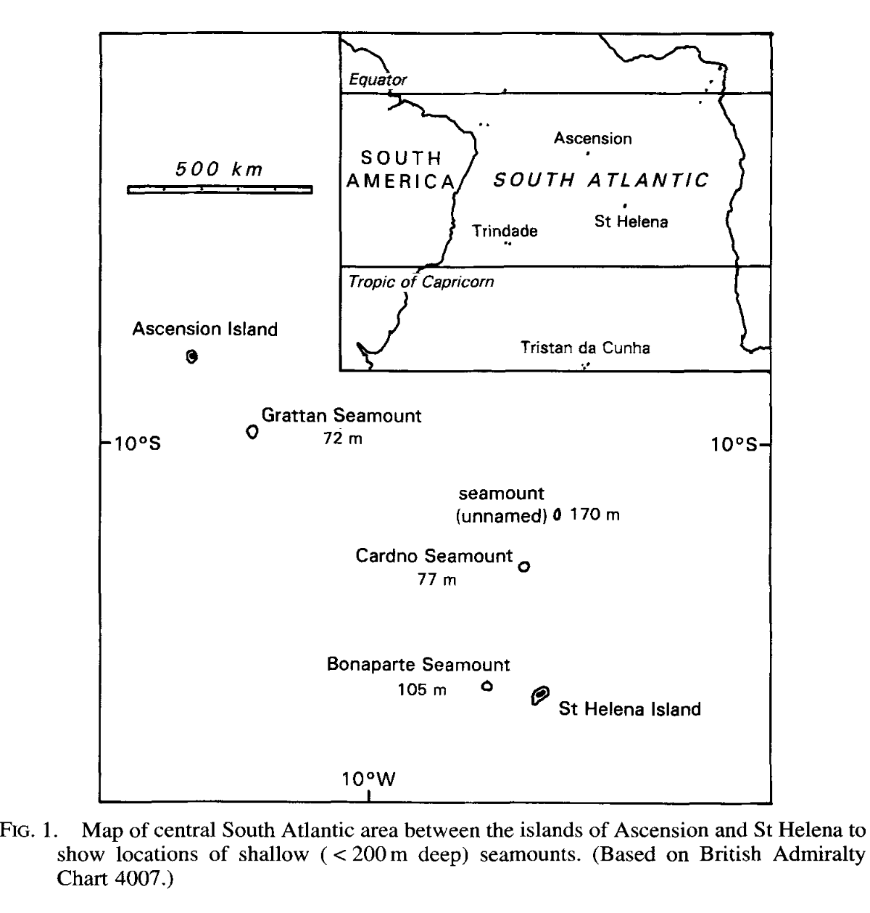
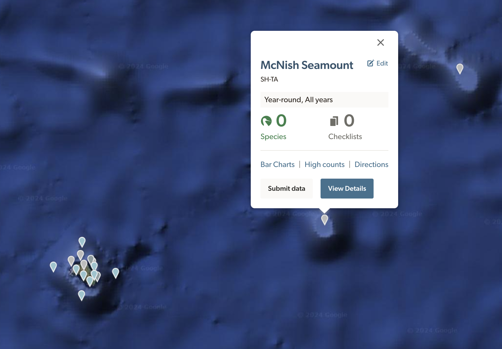



I am the eBird reviewer for St. Helena, Ascension, and Tristan da Cunha, three separate island archipelagos in the south Atlantic. They each have their own different ecology and biomes, with their own bird life that includes endemics for each group. Ascension and St. Helena are individual islands, with some small islets that often host large bird populations due to the lack of introduced predators. Tristan da Cunha has three main islands - Tristan, Nightingale, and Inaccessible - and then a fourth island much further south, Gough Island, which I sometimes think of as its own separate island group.

Recently, I was going through an old email from last year with my colleague Ian Worley to two other ornithologists, Andy Schofield and Steffen Oppel. Schofield mentioned that there is a marked difference in presence for Kerguelen Petrels at a few seamounts to the east of Gough: Yakhont and Crawford Seamount. I hadn't heard of either of these seamounts before, and started getting curious. 

The following image shows where these seamounts are. This is taken from a paper by Requena et al. 2020, and it helpfully names a few other seamounts - McNish and Zenker, R.S.A., and the Walvis Ridge, while also showing the different pelagic provinces that surround the islands. This also shows why Gough is so different from Tristan da Cunha and the other two islands; it is a few hundred kilometers south, which places it outside of the south central Atlantic Gyre, which means that the water temperature and nutrients are different.

The differences in the water realm is most marked near seamounts - islands which never break above the sea, and which aren't quite high enough to be reefs. There, water from the depths is brought up, bringing nutrients for plankton, and there is more habitat for different types of fish and other life, which in turn means more food for pelagic birds. Nesting birds on Gough might fly out to these seamounts to feed more preferably, something that Requena et al. discovered by tracking the movements of a few species they tagged on Gough. 

The large expanse of water near the islands isn't necessarily homogenous, and these ranges under the sea help influence life above them. As an eBird reviewer, this is important, because it means that when observers are taking ships to and from the islands, especially on large tours during the seasonal visiting months (normally April), their pelagic observations won't always have the same qualities. As a reviewer, it's my job to ensure that entries into the database reflect accurate observations from users, and that they don't have egregious data entry errors that would make the data less useful to future researchers. If someone saw many more birds in one spot than another, I might think it is suspicious. But knowing that there is a seamount there may help me judge whether an aberrant observation should be included in the database or not. 

Recently, Michael Schrimpf at eBird developed a massive mapping system that split up the pelagic High Seas and coastal reviewing areas into more discrete portions, which means that I can build separate filters for each island, and for some pelagic areas around them. Going forward, working in observations near seamounts into the filters may be important, too. 30 Kerguelen Petrels 100 kilometers to the west of Gough would be far less likely than 100 mile east of Gough, as there's no seamount there. That's interesting to know. 

Of course, being an eBird reviewer can be difficult, because I am not on the ground (or on the waves) observing birds, and I am both helping to curate the data as well as using it to improve my understanding of bird movements in the area. My assumptions are important to understand, because when an observation is in conflict with what I think is happening, I have to ask whether I know enough to judge whether an observation is likely to be an accurate, or, at the least, sufficiently documented.

Knowing about these mountains under the sea - some of which have names, some of which don't - will be helpful. After researching the seamounts near Tristan da Cunha, I looked for a few more seamounts to the north, for St. Helena and Ascension. 

I found this map of some seamounts north of St. Helena, towards Ascension. I also found another map of a final seamount, Harris Crawford, far to the west of Ascension. These aren't exactly terra incognita - this map came from a journal that described new fish found during a fishing expedition (Edwards, 1993), and fisherman are often the first humans to know about seamounts, as they're much more productive for certain species than the open ocean. That's one of the reasons many of these seamounts are named. 

It's useful for me to know that these seamounts exist, but it may also be useful for birders who are visiting these areas to know that they're near one. In order to facilitate that, I've set up hotspots for each of the named seamounts. There are many seamounts, and some which don't reach quite as far up as others. I decided to arbitrarily only include named seamounts in order to limit hotspot proliferation - hundreds of hotspots may not be as useful as just a few for general areas. I also decided not to make hotspots for the Walvis Ridge, as it's farther from the islands and as it extends all of the way to Walvis, a coastal city in Namibia. Setting one there would be akin to saying "Green Mountain hotspot" for the entire state of Vermont, on just one mountain.

I still haven't figured out which seamounts lie between St. Helena and Tristan da Cunha, but some sleuthing on bathymetric maps may show some. Hopefully, some birders going past these seamounts will select the hotspot location instead of a personal location, and we'll be able to slowly accumulate an idea of what birds use them throughout the year. For now, there's nothing to show for the effort of making them - I have to wait and see if they're used. But that's one of the fun parts of making hotspots. You create them, and wait. 

Of course, I hope that one day I'll be able to go out and see these locations myself. Until then, I'll keep going to the south Atlantic in my mind every week as I review observations from others. 

#### Cited

- Edwards, A. J. "New records of fishes from the Bonaparte Seamount and Saint Helena Island, South Atlantic." Journal of Natural History 27.2 (1993): 493-503.
- Requena, S., Oppel, S., Bond, A. L., Hall, J., Cleeland, J., Crawford, R. J., ... & Ryan, P. G. (2020). Marine hotspots of activity inform protection of a threatened community of pelagic species in a large oceanic jurisdiction. Animal Conservation, 23(5), 585-596.