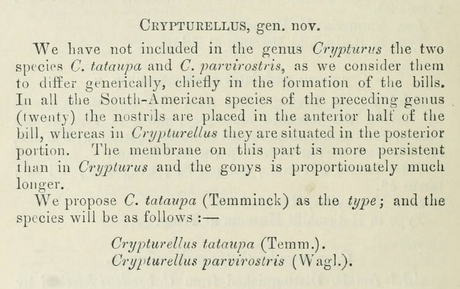



I want to share stuff, and I don't think I can easily, because of how publishing works.

I am currently going through a large list of scientific names for birds, looking for issues where grammatical agreement needs correction. In short, the [ICZN](https://www.iczn.org/) has a Code which moderates how all scientific names - the Latin ones, like _Passer domesticus_ or _Homo sapiens_, are properly formed and used. Part of this list concerns species names, which have to agree in gender with their genus (_domesticus_, masculine, must agree with _Passer_, masculine). People often get this wrong, because Latin and Greek are hard, and because the Code itself isn't always clear.

Right now, I am going through a host of names from South America. As I am finding names which are to be corrected, I am marking them out, and writing about them for a future article to publish somewhere, with peer-review and in, hopefully, a reputable journal like Zootaxa. This work is laborious, interesting, and delightful.

A problem I've been having with the work is that, besides my long-suffering partner and roommates, there's few people I can talk to about this work. If I post about a species name online, I'll need to cite myself when I write the journal article. If I post about a species name on [Codex Mutabilis](https://codexmutabilis), my journal for publishing name corrections validly according to the ICZN, then I can't include those corrections in a future publication - they're already done. But all of the interesting ones belong in this category. I could post about the other ones, but they're not as fun.

Take, for example, _Crypturellus obsoletus_, the Brown Tinamou. Look at that bird. It looks great.

But its name is confusing. _obsoletus_ is clearly a masculine Latin adjective - note the _-us_ ending. That word is only an adjective, in both Classical and Medieval Latin, so it could and should be changed to match the gender of _Crypturellus_, which has been done here. So, the gender of _Crypturellus_ has to be masculine.

But how can we know that? Well, it must come from _Crypt+urus_, probably. That means something like "Secret tail" in Greek. That's what [the etymological dictionary](https://birdsoftheworld.org/bow/key-to-scientific-names/search?q=crypturus) that Birds of the World uses says, too: "Gr. κρυπτος kruptos  hidden; ουρα oura  tail." This has been transliterated well according to best practices - the kappa becomes a _c_, the upsilon a _y_, and so forth. But how does ουρα become urellus?

Birds of the World notes it came from *Crypturus* Illiger 1811. That means that Illiger was a scientist who published making that name in 1811. The problem here is that the ICZN Code doesn't allow something that late to be Latin - Latin is only from the Classical and Medieval period, according to their Code's glossary. So, it can't be from that.

Here is the original description of _Crypturellus_ by Brabourne & Chubb, 1914, which you can read [here on archive.org](https://www.biodiversitylibrary.org/page/18616557).

Notice there is nothing about etymology in there, except mentioning *Crypturus*.

I suspect that most people reading this would point out that *urus* is the last word, and that *urellus* is just the diminutive, so that's fine, that looks masculine. But technically, _urus_ is not a well-formed word in Latin or Greek for "tail" - it's a Latinized form of *ουρα*, which should have been transliterated as _oura_ or more commonly _ura_. And even then, -*ellus* is a Latin suffix, not a Greek one. It could only apply if _urus_ was Latin.

The Code doesn't care about the etymology or whether a word is a mixture of Latin or Greek. But it does care about whether a scientific name ends in a Latin or Greek word or not. So, is *urellus* a word? Or, perhaps, some other form - *Crypturellus, Rypturellus, Ypturellus, Pturellus, Turellus, Urellus, Rellus, Ellus, Llus, Lus,* or *Us*?

Technically, both *Turellus* and *Lus* are words - both masculine nouns. But they are both also sort of not useful words - because they clearly weren't intended. Another one is *urus*, which is a masculine noun for "aurochs" (an extinct bovine animal), and *urellus* would be a valid word for "the little aurochs", although one wouldn't find it in the dictionary. It would also be masculine.

None of these three words are great. The last one is the best, because at least *Crypt* is a word, although, again, technically, the Code doesn't have anything written about making sensical divisions. The Code also doesn't talk about what to do if a word ends in multiple words at different points - how does one choose?

The clearest thing to do here is actually to use none of these words at all. Instead, either treat it as ουρα transliterated into *urus*, with an added suffix, which is masculine. The code actually talks about this a bit - "a Greek word with a change of ending", it says in Article 30. Or, treat the whole thing as a non-Latin or Greek word, as *Cyrpturus* as the name was intended isn't a Latin word according to the Code, because 1811 is after 1500.

I favor the second one, because it makes the most sense to me. The former doesn't because I don't know how to scope where the ending was changed. What's stopping me from calling "Crypturus" the word for "Gaia", with a very changed ending? Nothing except common sense. But common sense differs across people, and can't be measured, and isn't codified in the code anyway. The second one doesn't depend on that as much. _Crypturellus_ is simply not a Latin or a Greek word, under any definitions of those words.

Ok, so *Crypturellus* is masculine according to the Code, because it is not from Greek or Latin and it looks like a Latin masculine word. What does that mean for the other species names? Nothing. Everyone has already been assuming that *Crypturellus* is masculine. There are very few ways it could be anything else – technically, it could have been if it wasn't based off of Latin or Greek, and if the original authors made it available (used it for the first time) with an adjectival species-group name that was feminine. They use it at first with a species name ending in *rostris*, which makes it a noun, and the other name they use with it, *tataupa*, is also a non-Latin and non-Greek noun, as they explicitly state it came from Güaraní. So, again, it is masculine. Everyone has been assuming correctly. Nothing needs to be changed.

On to the next name.

This is the work which I am doing in between other work, because I like it. But all of the sleuthing above does nothing and goes nowhere, because it's not worth publishing, and it's not worth posting about. It's interesting _to me_, though, but that's all. It also takes far more time to write up than to actually do. The stuff that is more interesting comes when the conclusions I come up with mean that people have been reading the Code wrong. And I'd like to share those, but I'm not sure how to, until I finally publish the thing.

If anyone has ideas on how to publish or share that without sniping myself, let me know.
