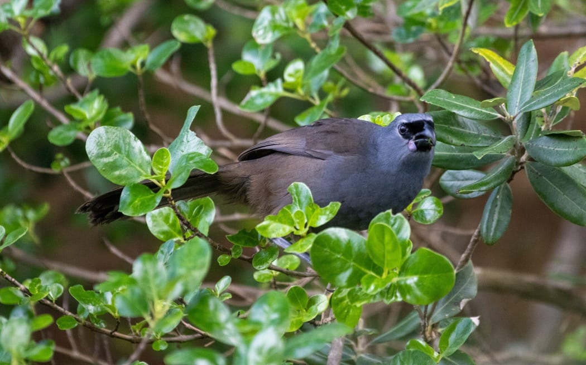



After the last [Wikicon Aotearoa in Ōtautahi Christchurch in May, 2025](https://en.wikipedia.org/wiki/Wikipedia:WikiCon_Aotearoa/Christchurch_2025), I made the decision to change the license on all of my iNaturalist photos to enable easy reuse for Wikipedia and elsewhere. I am not a professional photographer; while I have sold art before, and while I have had showings of my work, I don't prioritize returns on my photography. I am just happy to see it used.

Which is why I was excited to get a Google Alert a few weeks ago that my name had been published somewhere on the internet. In this case, I was pinged that I had been mentioned in an article called [Rat-free forest offers rare boost for kōkako north of Rotorua](https://www.rnz.co.nz/news/ldr/586759/rat-free-forest-offers-rare-boost-for-kokako-north-of-rotorua). The article talks about how an indigenous Māori-led conservation project in the north of the North Island is doing exceptionally well at eradicating predators that imperil the native birds here in New Zealand. The focal species for this project is the Kōkako, a beautiful endemic that has a haunting, organ-like call. I've only heard it once, on Tiritiri Matangi near Auckland, where I managed to snap some photos of a Kōkako as it munched on some [Taupata](https://en.wikipedia.org/wiki/Coprosma_repens) on the coast.

I didn't explicitly allow RNZ to copy this image. They didn't ask. They didn't need to, as [it is freely available under a CC-BY license on iNaturalist](https://www.inaturalist.org/observations/286751385). I don't profit on this work. That's OK. I profit in other ways - my work was part of a movement of people trying to save this rare species, and through having access to free, good imagery, the journalists were able to make the project come alive to a wider audience. That's profit enough.