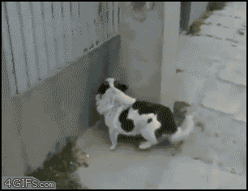



These projects are not meant to be either too focused to be lumped in a
larger heading, too slow to really be included somewhere else, or too
random or nascent to warrant anything but a raised eyebrow. For instance:

#####The Middle Construction

I am unhappy with the way that I've seen the middle diagnosed in the
literature. I am the webmaster for the [UKLO](http://www.uklo.org), and
at some point a couple of years ago [Dick
Hudson](http://www.phon.ucl.ac.uk/home/dick/home.htm) and I started
chatting about them. Without copying the whole conversation verbatim,
Dick said that:
> The line I would take, I think, is that middle verbs must all share some semantic relation which can be separated from the bundle of properties that define other semantic roles; let's call it 'responsible' since that seems to be the thing that distinguishes what I think of as the crucial pair (due to George Lakoff):  
>   
> (1)  _These books sell well._  
> (2)  _\*These books buy well._  

To which my response sums up my approach. I'm still working on making
this into an actual exposé on middle verbs. Any helps from a competent
semanticist would be greatly appreciated.

> Regarding the middle, I think you're right that there's a
> 'responsible' thematic role going on. However, I would disagree that
> that's the only event. _These books sell well_ doesn't say much about
> the books quality that makes it redundant. It's only a hypothetical
> feature of the books that causes it. However, I think that inherent in
> this construction is the agent; _These books sell well to certain
> customers_ seems to me to be a more well-formed construction. Put
> another way, the 'responsible' role only works if there is a role that
> shows what it is responsible for. However, this network, in this
> particular syntactic construction, depends on the 'responsible' word to
> be mentioned explicitly, and as the qualities of the agent (but not the
> thematic role) are dependent on the feature of the books, including
> them is redundant, so it can be excised. For a sentence like _This
> shirt won't wash clean_, there is an implicit assumption that it is
> either a stained shirt or that the detergent isn't good, or some event
> that can't happen due to some reason. In such a case, the 'responsible'
> isn't the shirt, in any event - it's the quality of the shirt that
> isn't specified in the agent, as the agent isn't allowed due to wash
> not being ditransitive."  

> I think that works. My terminology - allow, dependent, etc. - might
> not be good, but I think that teases out the issue of having a
> 'responsible' feature without having a 'responsible for what' issue.  

#####Event Semantics

I had an issue with sublexical semantics. In essence, I didn't like the
way that either
[Pustejovsky](http://en.wikipedia.org/wiki/James_Pustejovsky) or
[Rappaport
Hovav](http://www.huji.ac.il/dataj/controller/ihoker/MOP-STAFF_LINK?sno=9548470)
and [Levin](http://www.stanford.edu/~bclevin/) approached verbs. I also
didn't like how my teacher in my undergraduate course, [Nik
Gisborne](http://www.ppls.ed.ac.uk/people/nikolas-gisborne), approached
them, either. In all cases, it seemed like a big mess, although had I
known about HPSG or
[RRG](http://linguistics.buffalo.edu/people/faculty/vanvalin/rrg.html)
at the time, I don't think I would have made a fuss. In order to make
everything clear in my head, I took a weekend, skimmed a load of papers,
and wrote a new theoretical system that is more like C than anything
else, which is strange, as I don't know C, and as I didn't know how to
code at the time. I occasionally look at this paper, stare blankly at
it, and then move on to check other things that are more important, like
my tax record.  However, if anyone wants to have a stab at making sense
of it, [you're free to](files/LexSem.pdf). Nik's comments on the paper:  
>There is this brilliant, wierd, utterly inadequately worked through but
>exciting promising note of an original theory at the end.  
I am inclined to agree with him.  

#####Naming conventions in Science Fiction and Fantasy

This is a topic I am genuinely interested in and have given hundreds of
hours to. No, I mean it. Hundreds. For instance, I recently re-read all
of [the Wheel of Time](en.wikipedia.org/wiki/The_Wheel_of_Time) for the
sixth time, underlining all of the words from the Old Tongue, a made up
language used by Robert Jordan, and meant to be something like a
predecessor for English (although, it clearly isn't genetically). I did
the same thing for Game of Thrones, which resulted in [this wiki page](http://wiki.dothraki.org/dothraki/Other_languages). The references are a bit... revealing of what I did in the summer of 2009, while working at an ice cream shop in Princeton.

What I am interested in is this: how do fantasy authors think of names
for their characters, and what approaches do they take towards making
languages in their worlds? Some authors, like Tolkien, clearly spend
years making constructed languages, and the names of places and persons
often reflect that. Others make them up on the spot, unless anyone
thinks that the tongue of the Elder Gods in HP Lovecraft was actually
invented with _Ph'nglui mglw'nafh Cthulhu R'lyeh wgah'nagl fhtagn_ meant
to be part of a extant language never included in the store. Regarding
naming conventions, I'm mainly interested in two things: how character
names are chosen to be foreign enough to be exotic but close enough to
be natural in English - I'm thinking of names such as Aviendha, Elayne,
and Perrin - and how authors really want us to approach errant
apostrophres. How does one pronounce _R'lyeh_, anyway? If you're at all
interested in this, awesome. If you want to get in touch and talk about
it, awesomer. My main problem that needs to be addressed before I can
take this research further is that I want to get access to copyrighted
texts so that I can analyse them computationally, and that I am unsure
what literature exists about conlangs already, and how to approach
writing new literature for it.  

##### Multiword Expressions

Let's just say, for now, that I am interested in these, and am still
teasing out how I mean to say anything useful about them. In this case,
_interested_ means I took a course on them and continue to download and
read the odd paper.

##Non-Linguistic

I am interested in other research besides language, because research and
publication is a way to give back to the world by filling it with more
useful information, and it can all be done from the safety of one's living
room.

#####Mammalian Reintroductions in Great Britain

I am very interested in the curious case of beavers in Scotland, and,
more recently, raccoon dogs in Wales. I am curious, but less interested
in boar and American mink across England. I am continuously reading
articles that have to do with mammal introductions in Western Europe,
and on comparisons between European and American beavers. I have
absolutely no ability to do any sort of fieldwork, and no idea how to
continue, so for now, I'll just keep reading my favourite journals
online until you get in touch to help out. My current thinking involves
writing a review article on literature comparing US vs European beaver
effects on the local environment.

#####Mung (Or Pylaiella and Macroalgal Blooms)

I summed up my interest in this area in a [Research Blog](http://researchblogging.com/) post, and got an Editor Selection award of which I am still proud. Just [read this](http://www.burntfen.net/merecat/?p=418) if you like seaweed and the ocean and Cape Cod.

#####Wetlands

I want to know more about how anglophonic communities, particularly in
New England and Scotland, approach wetlands. Right now I know very
little.

#####Self Organisation of Sound Levels in Crows and Pubs

I think that says it all. [This says more](http://replicatedtypo.com/crows/4784.html), if you need it.

#####Aspens

I have been spending a few years on and off trying to find similarities
between aspen root networks and language networks. As far as anyone can
tell, this has been a fun waste of time.

#####Tool Use in Canids

I am still trying to figure out if this is tool use or not.

If you made it this far, I am very surprised.
